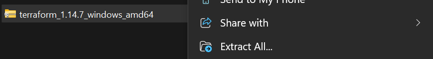
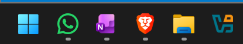
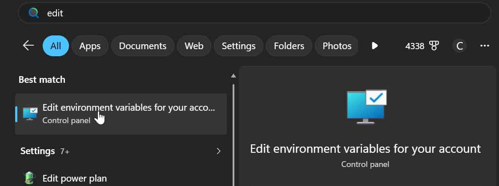
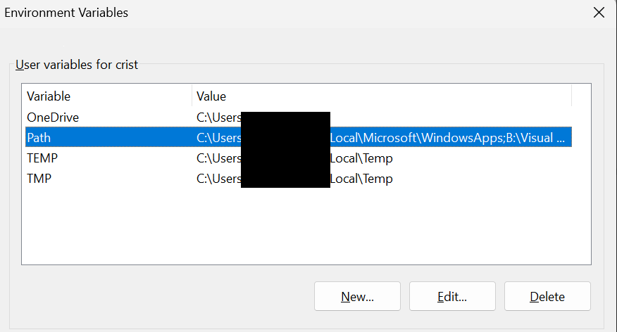
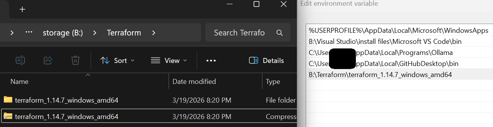
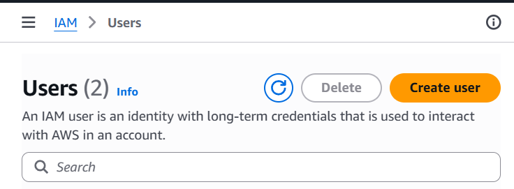
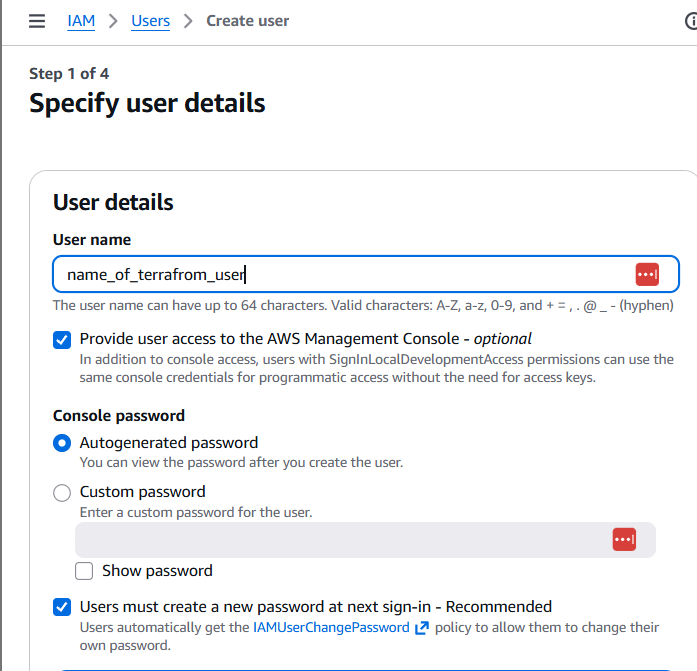
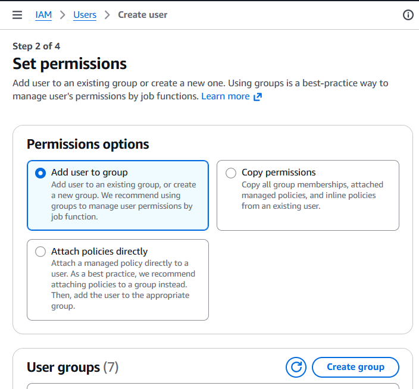
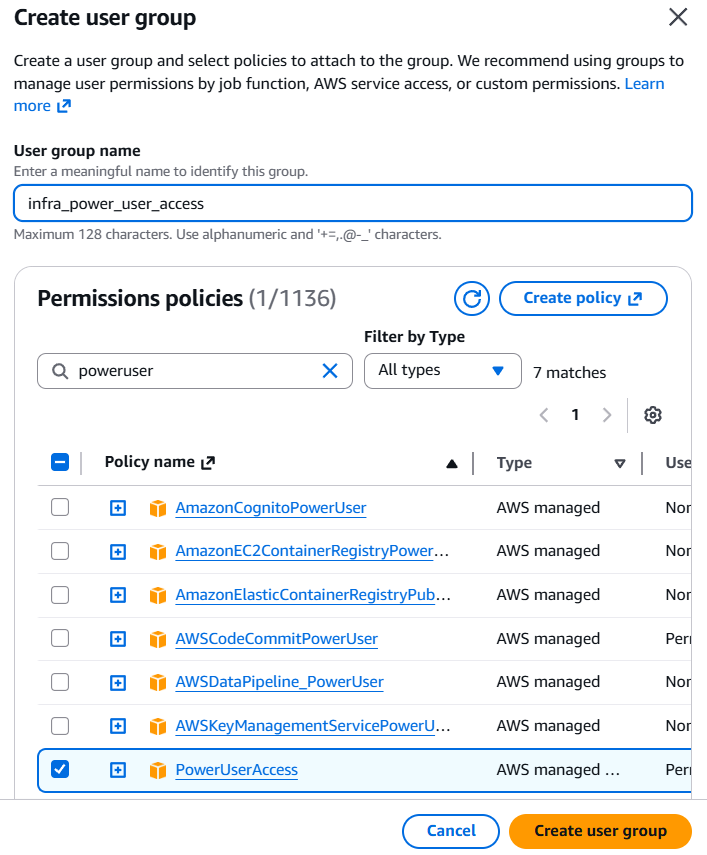

# FSCT 8592 Terrafrom Assignment

## Design 


## Implementation. 


## Testing. 


## Terraform Installation and Setup Guide: Table of Contents
- [Installing Terraform](#installing-terraform)
  - [Download Terraform](#download-terraform)
  - [Extract Terraform](#extract-terraform)
  - [Add Terraform to PATH Variable](#add-terraform-to-path-variable)
- [Add AWS User Credentials to Terminal](#add-aws-user-credentials-to-terminal)
- [Terraform Commands](#terraform-commands)

## Installing Terraform

### Download Terraform
| Terraform Version | Terraform Link |
| --- | --- |
| Latest Version | https://developer.hashicorp.com/terraform/install#windows |
| All Versions | https://releases.hashicorp.com/terraform |

### Extract Terraform
Right-click the .zip file and select "Extract All".



### Add Terraform to PATH Variable
1. Press the Windows key or the Windows button (blue square) on the left-hand side.
   

2. Enter "Edit System Variables" in the search bar to open the panel.
   

3. Click on the PATH variable, then click Edit.
   

4. Add the Terraform location, then click OK.
   

## Add AWS User Credentials to Terminal

1. In IAM, create a user for Terraform.  
   IAM: Identity Access Management - Create users that can access the account.

   

2. Give the user a name and enable access to the console.

   **Make sure to enable "Provide user access to AWS Management Console".**

   

3. In Permissions options, give the user "PowerUser" privilege.

   - Select "Add user to group"

   Click "Create group".
   

   Create a security group with PowerUser permissions.
   

4. Place the user credentials into the following format, then paste them into a terminal:

   ```
   $env:AWS_ACCESS_KEY_ID="xxxxxxxxxxxxxxxxx"
   $env:AWS_SECRET_ACCESS_KEY="yyyyyyyyyyyyyyyyyyyyyyyyyyyy"
   $env:AWS_DEFAULT_REGION="zzzzzzzzz"
   ```

## Terraform Commands

| Terraform Command | Description |
| --- | --- |
| `terraform destroy` | Deletes the infrastructure that was created |
| `terraform plan` | Shows what changes will be made |
| `terraform apply` | Deploys the infrastructure |
<!-- | || -->